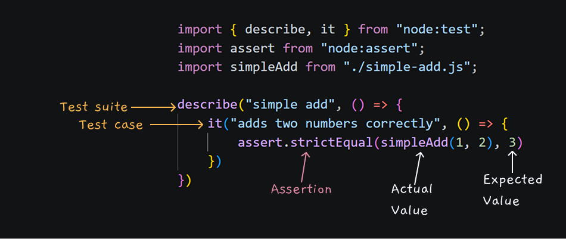

# Test Runner and Assertion Library

Our first milestone is to test a small pure function. 

A pure function's output depends only on its inputs. They also do not produce side effects. So our job is simply to run a test that compares the expected result to the actual output.

## Defining responsibilities

A **test runner** finds and executes tests, organizes them into suites, and reports their results. In this example, `describe` and `it` come from Node's built-in `node:test` module.

An **assertion library** compares the result we observed with the result we expected. Here, `strictEqual` comes from Node's built-in `node:assert` module.

These responsibilities are often packaged together, which can make them appear to be one thing. They do not have to come from the same project: Mocha and Chai are a familiar example of a separate runner and assertion library often used together.

## The anatomy of a test

The code under test is a JavaScript function that adds two values. The runner executes the test, and the assertion checks that calling the function with `1` and `2` produces `3`.



See [`simple-add.test.js`](./simple-add.test.js).

The runner invokes the callback registered by `it`. Inside that callback, `strictEqual` compares the actual value with the expected value. If they differ, the assertion throws an error. The runner captures that error, associates it with the test case, and reports the failure. In other words, the assertion decides whether the expectation was met; the runner manages when the check runs and how its outcome is reported.

## Running the test suite

To run the tests, use:

```bash
npm test
```

The passing result is evidence that we can now execute JavaScript tests and evaluate their results without installing any third-party dependencies.

## Module format

Although the example uses `import` and `export`, it still runs in Node. The `"type": "module"` field in `package.json` tells Node to interpret the `.js` files as ECMAScript modules. Module format controls how the files are loaded; it does not provide browser APIs.

## Takeaway

So far, we have separated two responsibilities that every automated test setup needs to fulfill: something executes and reports the tests, and something decides whether an observed result meets an expectation. A single tool can provide both responsibilities, or separate tools can work together.

In this example, Node's runner invoked our test, the assertion confirmed that the actual and expected values matched, and the runner reported the passing outcome.

## Next step: Test environment

Our tests currently run in Node, which does not provide browser APIs such as `document` and `window`. Next, we will add jsdom to supply implementations of the web standards our UI code needs, while keeping the runner and assertion library we already have.
